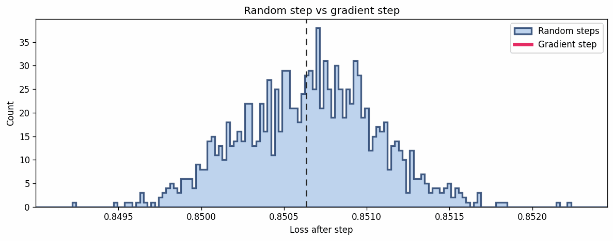
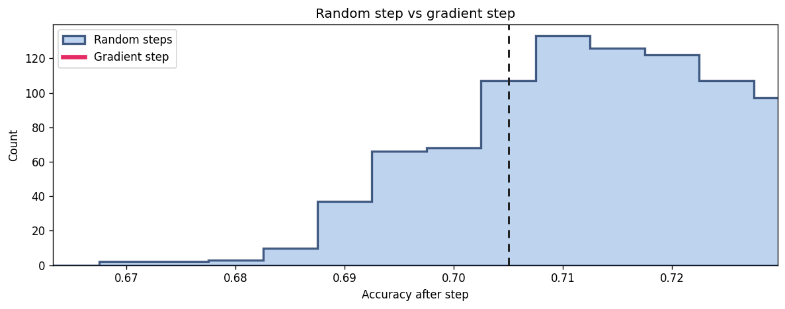

# One-Step Gradient vs Random Step

[](https://colab.research.google.com/drive/1eQuyHt0h-v5lwoyFhsxRco-U1FPdPOMz?usp=sharing)







- The PPO one-step update has norm `||Δθ_PPO||_2 = 1.79614`.

- A Gaussian perturbation is sampled as `ε ~ N(0, σ^2 I)`, and its raw norm can be much larger (example: `||ε||_2 = 55.6` for a 3B model).


## What do the figures mean?

- **First figure (reproduced from [a 2022 post](https://x.com/stanislavfort/status/1529865444701577216)):** For a small CNN on CIFAR-10, we measure the loss change from random steps matched in length to a gradient step at the same weights. The gradient step is approximately a 185-sigma event, essentially impossible to obtain from random directions.

- **Second figure**: The story changes with a good pretrained model (3B parameters): there is about a 16% chance that one random step outperforms one gradient step. (Note: Noises are rescaled to have the same norm as the PPO one-step)


## Usage (Local)

```bash
python compare_ppo_randopt.py \
  --base_model Qwen/Qwen2.5-3B-Instruct \
  --ppo_ckpt <your_ppo_step1_ckpt> \
  --data_path <your_eval_parquet> \
  --out_dir outputs/compare_grpo_randopt
```